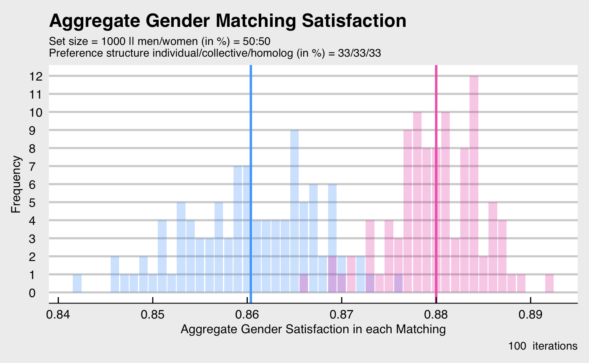
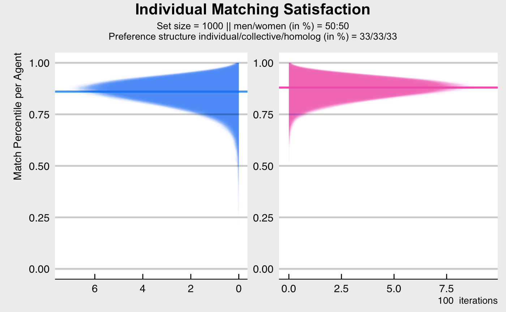

# matching
This R code generates a reproducible two-sided matching market in which m men and n women are matched up by the Deferred Acceptance Algorithm (DAA) by Gale & Shapley. This code allows to analyze the effect of set size, gender distribution and preference structures (perfectly independent, correlated, intercorrelated, or weighted) on both the male-optimal and the female-optimal version of the DAA

1.	Generate Matching Network and Preferences
-	Generate a matching network, consisting of two sets (M men and N women)
-	Each agent has certain preferences (or utility) for each agent of the other set 
-	Each preference combines three elements:
o	Independent: each single preference is completely independent from all other preferences
o	Collective: All men agree on the same rating for each of the women, and vice-versa
o	Homolog: If a man likes a woman, the woman likes him back just as much
o	(uI + uC + uH) = 1 (í researcher can modify weight)
-	If my network has 50 men and 50 women, there are 2 * 50 * 3 * 50 = 15.000 random values in this matching network

2.	Match up Men and Women in stable 1:1 Matches
-	The matching package now runs twice to match all agents in the network: once in the male-optimal, and once in the female-optimal variant
o	If the results are identical, this is proof that only one stable matching exists in this network
o	If genders are unequal (e.g. 60 men, 40 women), I would expect some agents to remain unmatched (in this case 20 men)
-	The results are displayed as following: given the in step 1 generated network, what is the minimal/average/maximum score for both genders in each algorithm variant, and how unfair was this matching? I expect 12 satisfaction scores and 2 Gini Coefficients (which I repeated 3x to fit into the results table)

3.	Repeat 1&2 X times
-	Now, as results from 2 depend on the seed I set at the beginning, each step described above is repeated X times (e.g. 200x). Each time a new network with new agents and new preferences is generated, I would expect a slightly different result
-	The end result is the average of all X repetitions. I expect this to be the most likely result for the 201st repetition. I am also interested in the variance of these 200 results
